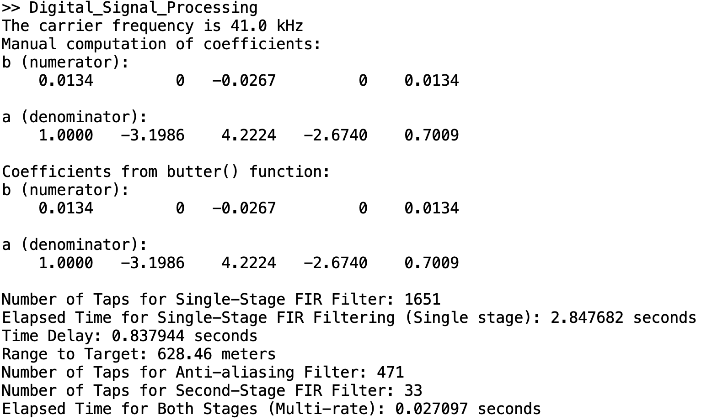

# **Digital Signal Processing Project**  

---

## **Overview**  

This project involves analyzing a sonar signal, designing digital filters, and detecting a target echo to calculate its range. The MATLAB script performs **time-frequency domain analysis**, **bandpass filtering**, **envelope detection**, and **multi-rate filtering**.

---

## **Implementation**  

### **Section 1: Time and Frequency Domain Analysis**  
- Reads and analyzes the sonar signal.  
- Plots the **outgoing sonar pulse** and the **received signal** in the **time** and **frequency domains** using:  
    - `pspectrum()` for frequency spectrum analysis.  
    - `fft()` with normalization and logarithmic scaling for custom frequency analysis.  
- Determines the **carrier frequency** as an exact multiple of 1 kHz.  

---

### **Section 2: Bandpass Filter Design**  
- Designs a **2nd-order Butterworth Bandpass Filter** using the manual `butter()` function's math with:  
    - **Cutoff frequencies:** Carrier frequency ± 10 kHz.  
- Implements a low-level **IIR filter convolution sum** manually to verify filter correctness.  
- Plots the filtered signal in both time and frequency domains to reveal the echo.  

---

### **Section 3: Envelope Detection**  
- **Full-Wave Rectification** using the `abs()` function on the filtered signal.  
- Designs a **single-stage FIR Lowpass Filter** with the following specifications:  
    - Passband edge: *1 kHz*  
    - Stopband edge: *2 kHz*   
- Verifies the filter’s frequency response and manually implements convolution for filtering.  
- **Calculates the range to the target** using the time delay between the outgoing pulse and echo signal.  

---

### **Task 4: Multi-Rate Lowpass Filter**  
- Implements a **2-stage lowpass filtering** process with:  
    1. **Anti-aliasing filter** to decimate the signal by a factor of 50.  
    2. Second-stage filtering to reduce computational complexity .i.e., number of taps by reducing the sampling frequency.  
- Quantifies the **computational load** savings theoretically and measures MATLAB execution times for:  
    - Single-stage FIR filtering.  
    - Multi-rate FIR filtering.  

---

## **Instructions for Running the Code**  
1. **Run the Script**:  
   - Save the provided MATLAB code as `Test.m`.  
   - Run the script using the MATLAB Editor or Command Window.  

2. **Outputs**:  
   - Time and frequency domain plots for analysis.  
   - Filtered and rectified signals.  
   - Computational time measurements for single-stage and multi-rate filtering.  
   - **Calculated target range** in meters.  

---

## **Key Notes**  
- **Custom Filtering**: IIR and FIR filters are implemented manually for low-level verification.  
- **Execution Time**: Execution time for single-stage and multi-rate filtering is measured using `tic` and `toc`.  
- **Code Organization**: Sections are clearly labeled, commented, and separated by tasks.  

---

## **Results Summary**  

- **Carrier Frequency**: Displayed in kHz.  
- **Target Range**: Calculated and displayed in meters.  
- **Filter Performance**: Frequency responses are plotted to verify filter performance.  
- **Computational Savings**: Theoretical and experimental savings are presented for multi-rate filtering.  

---

## **MATLAB Version**  
The script is tested on **MATLAB R2024b**.